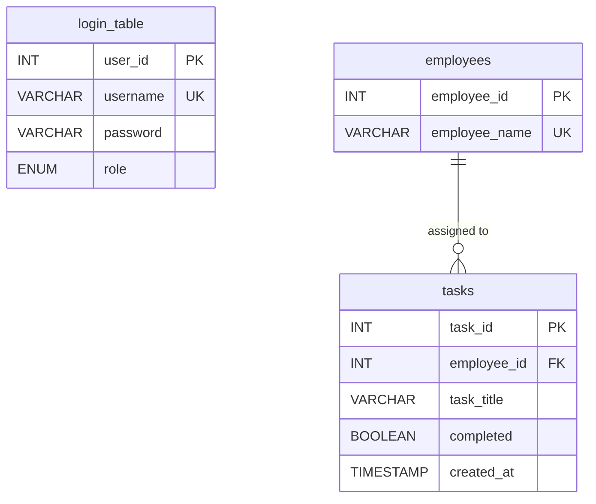

# TaskFlow — Task Management System

**A full-stack web application for assigning, tracking, and reporting employee tasks.**

| | |
|---|---|
| **Course** | MP Online Internship — Software Development |
| **Batch** | 10B |
| **Project Type** | Internship Project Submission |
| **Author** | Yash Singh ([@Yash-Singh607](https://github.com/Yash-Singh607)) |
| **Technologies** | HTML · CSS · JavaScript · Python (Flask) · MySQL |

---

## Project Details

| Field | Information |
|-------|-------------|
| **Programme** | MP Online Internship Programme |
| **Course** | Software Development |
| **Batch** | 10B |
| **Project Title** | Task Management System (TaskFlow) |
| **Submitted By** | Yash Singh |

> This project is developed as part of the **MP Online Internship — Software Development Course (Batch 10B)**, demonstrating practical skills in front-end development, Python back-end programming, and MySQL database management.

---

## Abstract

TaskFlow is a browser-based **Task Management System** submitted for the **MP Online Internship — Software Development Course (Batch 10B)**. It is designed for organizations where **Admin** and **Manager** users assign work to employees, monitor completion status, and view analytics — all backed by a relational **MySQL** database.

The system follows a classic **three-tier architecture**: a responsive front-end (HTML/CSS/JS), a Python **Flask** middleware layer that handles authentication and REST APIs, and a **MySQL** database with normalized tables and foreign-key relationships.

---

## Problem Statement

Manual task assignment through spreadsheets or messaging is error-prone and difficult to audit. Organizations need a centralized system where:

- Managers can **assign tasks** to employees quickly
- Task status (**Pending / Completed**) is tracked in real time
- Employee records are maintained in one place
- Admins can **view reports** on workload and completion rates

TaskFlow addresses these requirements with a secure login, intuitive dashboard, and persistent MySQL storage.

---

## Objectives

- [x] Role-based login for **Admin** and **Manager**
- [x] CRUD operations on tasks (Create, Read, Update, Delete)
- [x] Employee directory with search and inline add
- [x] Foreign key relationship between `tasks` and `employees`
- [x] RESTful JSON APIs consumed by the front-end
- [x] Reports panel with completion metrics and task-type breakdown
- [x] Professional, responsive UI

---

## Technology Stack

| Layer | Technology | Purpose |
|-------|------------|---------|
| **Presentation** | HTML5, CSS3, JavaScript | Login page, dashboard, forms, task table |
| **Application** | Python 3, Flask 3 | Routes, session auth, REST API, business logic |
| **Database** | MySQL / MariaDB | Persistent storage with FK constraints |
| **Security** | Werkzeug (bcrypt hashing) | Password hashing, Flask sessions |

---

## System Architecture

```
┌─────────────────────────────────────────────────────────┐
│                    CLIENT (Browser)                      │
│         HTML Templates  ·  CSS  ·  JavaScript (app.js)   │
└──────────────────────────┬──────────────────────────────┘
                           │  HTTP / JSON
┌──────────────────────────▼──────────────────────────────┐
│              MIDDLEWARE  (Flask — app.py)                  │
│   Login · Sessions · Task API · Employee API · Validation  │
└──────────────────────────┬──────────────────────────────┘
                           │  mysql-connector-python
┌──────────────────────────▼──────────────────────────────┐
│                   DATABASE  (MySQL)                        │
│      login_table  ·  employees  ·  tasks  (FK linked)     │
└─────────────────────────────────────────────────────────┘
```

---

## Database Design

Three related tables with a **foreign key** from `tasks.employee_id` → `employees.employee_id`, as required for normalized relational design.



| Table | Description |
|-------|-------------|
| `login_table` | Stores Admin / Manager credentials (hashed passwords) |
| `employees` | Master list of employees (~1000+ seeded, A–Z names) |
| `tasks` | Tasks assigned to employees; auto-increment `task_id` |

**Key design decisions:**
- `employee_id` foreign key ensures every task belongs to a valid employee
- `ON DELETE RESTRICT` prevents orphan data
- Task IDs are **renumbered sequentially** after deletion to maintain order
- Passwords stored using **Werkzeug password hashing** (never plain text)

---

## Features

### Authentication
- Secure login with username, password, and role selection
- Flask session management with `@login_required` decorator
- Flash messages for login success / failure

### Dashboard
- Live metrics: Total Tasks, Pending, Completed
- Assign Task form with employee search combobox
- Task table with Edit / Remove actions
- Auto-generated Task ID (MySQL `AUTO_INCREMENT`)

### Employee Management
- Searchable employee directory (1000+ records)
- Add new employees from the UI or inline during task assignment
- Real-time employee count

### Reports & Analytics
- Completion rate percentage
- Average tasks per employee
- Breakdown of tasks by type (Documentation, Code Review, Bug Fix, etc.)

### UI / UX
- Modern **TaskFlow** branding inspired by professional tools (Notion, Asana, Linear)
- Sidebar navigation: Dashboard · Employees · Reports
- Employee avatars with initials, status pills, responsive layout

---

## API Endpoints

| Method | Endpoint | Description |
|--------|----------|-------------|
| `GET` | `/api/employees` | List all employees |
| `POST` | `/api/employees` | Add a new employee |
| `GET` | `/api/tasks` | List all tasks (sorted by ID) |
| `POST` | `/api/tasks` | Create a new task |
| `PUT` | `/api/tasks/<id>` | Update an existing task |
| `DELETE` | `/api/tasks/<id>` | Delete a task and renumber IDs |

All API routes require an active login session.

---

## Prerequisites

Before running the project, ensure you have:

| Software | Version | Notes |
|----------|---------|-------|
| Python | 3.10+ | [python.org](https://www.python.org/downloads/) |
| MySQL or MariaDB | 8.0+ / 10.4+ | Via XAMPP or MySQL Server |
| pip | Latest | Comes with Python |

---

## Installation & Setup

### Step 1 — Clone the repository

```powershell
git clone https://github.com/Yash-Singh607/task-management-system.git
cd task-management-system
```

### Step 2 — Install Python dependencies

```powershell
pip install -r requirements.txt
```

### Step 3 — Configure MySQL

1. Start **MySQL** (XAMPP Control Panel → Start MySQL)
2. Copy the environment file and edit if needed:

```powershell
copy .env.example .env
```

Default `.env` settings:

```env
MYSQL_HOST=127.0.0.1
MYSQL_PORT=3307
MYSQL_USER=root
MYSQL_PASSWORD=
MYSQL_DATABASE=task_management
```

> **Note:** If MySQL 8.0 Service occupies port 3306, use XAMPP MariaDB on port **3307**, or stop the `MySQL80` Windows service and use port 3306.

### Step 4 — Initialize the database

```powershell
python setup_db.py
```

This creates the database, tables, default users, and seeds 1000+ employee names.

### Step 5 — Run the application

```powershell
python app.py
```

Open your browser at: **http://127.0.0.1:5000**

### Step 6 — Verify connection (optional)

```powershell
python check_db.py
```

---

## Demo Credentials

| Role | Username | Password |
|------|----------|----------|
| Admin | `admin` | `admin123` |
| Manager | `manager` | `manager123` |

---

## Project Structure

```
task-management-system/
│
├── app.py                  # Flask application — routes & REST API
├── config.py               # Configuration (.env support)
├── db.py                   # MySQL connection & helper functions
├── setup_db.py             # Database initialization & seed script
├── check_db.py             # Connection test utility
├── requirements.txt        # Python dependencies
│
├── database/
│   ├── schema.sql          # MySQL DDL (CREATE TABLE statements)
│   └── employee_names.py   # A–Z employee name generator
│
├── templates/
│   ├── login.html          # Login page
│   └── dashboard.html      # Main dashboard (panels & forms)
│
└── static/
    ├── css/style.css       # Application styles
    ├── js/app.js           # Front-end logic (API calls, combobox)
    └── images/             # UI assets & hero images
```

---

## How It Works (Viva Points)

1. **User logs in** → Flask validates credentials against `login_table` using hashed password comparison.
2. **Dashboard loads** → JavaScript fetches tasks and employees via `/api/tasks` and `/api/employees`.
3. **Manager assigns a task** → Form data is sent as JSON to `POST /api/tasks` → Flask inserts into MySQL.
4. **Task appears in the table** → Sorted by `task_id ASC`, status shown as Pending / Completed pill.
5. **Delete a task** → Flask removes the row and **renumbers** remaining IDs to keep order (1, 2, 3…).
6. **Reports panel** → Client-side aggregation of task data for completion rate and type breakdown.

---

## Future Enhancements

- Employee self-login to view assigned tasks only
- Email notifications on task assignment
- Export reports to PDF / Excel
- Role-based task visibility filters
- Dark mode toggle

---

## References

- Flask Documentation — https://flask.palletsprojects.com/
- MySQL 8.0 Reference — https://dev.mysql.com/doc/
- MDN Web Docs (HTML/CSS/JS) — https://developer.mozilla.org/

---

## License

This project was developed as part of the **MP Online Internship — Software Development Course, Batch 10B**. Free to use for educational purposes.

---

<p align="center">
  <strong>TaskFlow</strong> — Task Management System<br>
  <sub>MP Online Internship · Software Development · Batch 10B</sub><br>
  <sub>Submitted by Yash Singh</sub>
</p>
